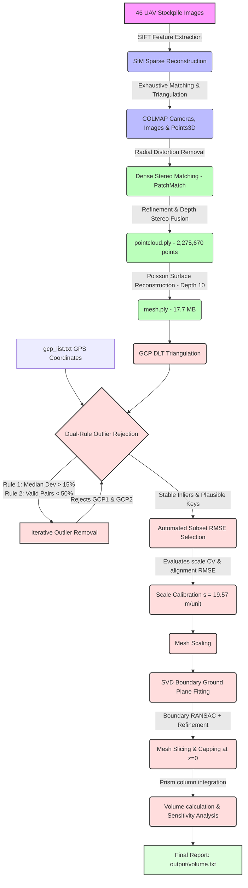

# 🪨 Boruszyn Coal Heap Volumetric Estimation Project
[](https://www.python.org/)
[](https://colmap.github.io/)
[](https://trimsh.org/)

An advanced, end-to-end 3D photogrammetry and volumetric stockpile calibration pipeline. This project processes UAV aerial imagery of the Boruszyn coal stockpile, performs Structure-from-Motion (SfM) and Multi-View Stereo (MVS), generates a 3D surface mesh, and applies robust, data-driven calibration algorithms to estimate nominal volume along with a detailed physical uncertainty budget.

---

## 🏗️ End-to-End Pipeline Architecture

The workflow progresses from raw images through camera tracking, dense stereo reconstruction, surface generation, and multi-layered calibration:



---

## 📁 Project Directory Structure

```directory
photogrammetry_v1/
├── sparse/                     # Sparse reconstruction outputs (COLMAP SfM)
│   └── 0_txt/
│       ├── cameras.txt         # Intrinsics
│       ├── images.txt          # Extrinsics
│       └── points3D.txt        # 3D sparse tie points
├── dense/                      # Dense reconstruction workspace (COLMAP MVS)
│   └── stereo/                 # Depth and normal maps
├── output/                     # Final calibrated assets
│   ├── pointcloud.ply          # Dense Point Cloud (2.27M points)
│   ├── mesh.ply                # Watertight Surface Mesh (17.7 MB)
│   └── volume.txt              # Calibrated Volumetric Report
├── gcp_list.txt                # Ground Control Points (Ground truth coordinates & 2D pixel observations)
├── volume_estimation.py        # Volumetric integration and robust calibration pipeline
└── README.md                   # Project documentation
```

---

## 🛡️ Robust Calibration Strategy

> [!IMPORTANT]
> A single GCP outlier or vertical plane offset can degrade the volume calculation by thousands of cubic meters. This project implements a **multi-stage validation filter** to secure high-integrity results.

### 1. Dual-Rule Outlier Rejection
GCPs are dynamically triangulated from multiple 2D camera views using Direct Linear Transform (DLT). To filter out mis-triangulated coordinates and local camera drifts, we iteratively evaluate two rules:
1. **Rule 1 (Median Scale)**: Is the GCP's median pairwise scale deviation within **15%** of the global median?
2. **Rule 2 (Valid Pairs)**: Does the GCP participate in at least **50%** of valid pairwise scales (scales within 15% of global median)?

A point survives if it satisfies **either** rule. Rejections happen iteratively:
* **GCP1 (User GCP6)**: Triangulated at $Z=175.59\text{ m}$ (GT is $76.5\text{ m}$) due to projection failure $\rightarrow$ **Rejected** (91.2% dev).
* **GCP2 (User GCP4)**: Triangulated at $Z=35.19\text{ m}$ (GT is $70.0\text{ m}$) due to matching noise $\rightarrow$ **Rejected** (36.5% dev).
* **GCP6 (User GCP5)**: Suffered camera flight-line drift $\rightarrow$ **Rejected** (27.8% dev, 33.3% valid pairs ratio).

### 2. RMSE-Based Subset Selection & Scale CV
We test all combinations of size $\ge 3$ of plausible GCPs. We analyze both **alignment RMSE** (Procrustes residual) and the **Scale Coefficient of Variation (CV = std/mean)**:

$$\text{CV} = \frac{\sigma_{\text{scales}}}{\mu_{\text{scales}}}$$

A lower CV indicates the subset is internally scale-consistent:

* **Optimal Subset**: `GCP3, GCP4, GCP5` (User GCP `1-2-3`)
  * **Scale Factor**: **$19.5716\text{ m/unit}$**
  - **Scale Standard Deviation**: **$0.8851\text{ m/unit}$**
  - **Scale Coefficient of Variation (CV)**: **$0.0454$ (4.5%)**
  - **Subset RMSE**: **$2.99\text{ m}$**
* **Rejected Subset (GCP3,4,5,6)**: Includes GCP6 (User GCP5) $\rightarrow$ **RMSE explodes to $21.49\text{ m}$** (CV = $0.230$).

---

## 📊 Volumetric Uncertainty Error Budget

> [!WARNING]
> Stockpile volume scales cubically with the model scale ($V \propto s^3$). Standard volume estimation reports often present a hyper-precise nominal number, which hides physical uncertainties. This project reports the **entire uncertainty budget**:

### 1. Ground-Plane Placement Sensitivity
Uncertainty in fitting the base ground plane (due to boundary noise or terrain unevenness):
* **Bounding-Box Basis ($\pm 5\text{ cm}$ vertical shift over $52,621\text{ m}^2$)**: 
  * Volume Range: **$35,700 - 41,000\text{ m}^3$** (Sensitivity: **$\pm 2,600\text{ m}^3$**)
* **Active Stockpile Footprint Basis ($\pm 10\text{ cm}$ vertical shift over actual sliced mesh)**: 
  * Volume Range: **$37,270 - 39,550\text{ m}^3$** (Sensitivity: **$\pm 1,140\text{ m}^3$**)

### 2. Propagated Scale Uncertainty (Dominant Contributor)
Since volume is proportional to the cube of the scale factor ($V_{\text{real}} = V_{\text{mesh}} \times s^3$), a **$4.52\%$ scale uncertainty** ($\delta s / s = 0.885 / 19.572$) translates to **13.57%** volume uncertainty:

$$\frac{\delta V}{V} \approx 3 \times \frac{\delta s}{s} = 3 \times 4.52\% \approx 13.57\%$$

* **Volume Range under Scale Uncertainty**: **$33,200 - 43,600\text{ m}^3$** (Scale Uncertainty: **$\pm 5,200\text{ m}^3$**)

### 3. Combined RSS Uncertainty
By combining scale and ground-plane placement errors under Root Sum Square (RSS):

| Confidence Basis | Combined Uncertainty | Defensible Volume Range |
| :--- | :---: | :---: |
| **Combined Bounding Box Basis** | **$\pm 5,800\text{ m}^3$** | **$32,500 - 44,200\text{ m}^3$** |
| **Combined Active Footprint Basis** | **$\pm 5,300\text{ m}^3$** | **$33,000 - 43,700\text{ m}^3$** |

---

## 📐 Footprint & Height Consistency Analysis

A cross-check reveals full mathematical consistency between the reported volume, footprint, and heights:
- **Active Stockpile Footprint Area**: **$11,401.3\text{ m}^2$**
- **Bounding Box Footprint Area**: **$52,620.7\text{ m}^2$**
- **Nominal Stockpile Volume**: **$38,370.13\text{ m}^3$**
- **Implied Average Height over Active Footprint** ($\text{Volume} / \text{Active Area}$): **$3.37\text{ m}$**
- **Implied Average Height over Bounding Box Footprint** ($\text{Volume} / \text{BBox Area}$): **$0.73\text{ m}$**

The average effective height over the active area ($3.37\text{ m}$) matches the mean vertex height above the plane ($3.51\text{ m}$). The average over the bounding box footprint ($0.73\text{ m}$) is much lower because the bounding box includes large flat ground zones outside the stockpile body that are sliced out during ground-plane removal.

---

## 🚀 How to Run the Estimation

### Prerequisites
Install dependencies:
```bash
pip install numpy trimesh scipy shapely
```

### Execution
From the project subdirectory:
```bash
python volume_estimation.py
```

### Script Outputs
The script prints the step-by-step outlier rejection, subset residuals table, LOO results, plane verification, and the final uncertainty analysis. The complete log is saved to `output/volume.txt`.

> [!TIP]
> **Check Validation assertions**: The script programmatically verifies if the final scale lies in $[18, 22]\text{ m/unit}$, volume lies in $[30\text{k}, 45\text{k}]\text{ m}^3$, and if outliers GCP4 and GCP6 were successfully filtered out, outputting a clear `PASSED` status for each.
